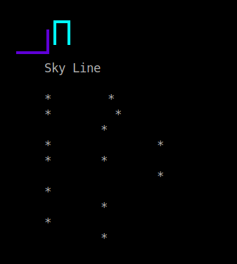

<p align="center">
  
</p>

# Description

SkyLine is a cyber security rounded programming language currently in development. This programming language will feature a major focus on mathematics and cyber security. The language has the below like syntax 

```rust
Func OutputStr( name -> of type String, age -> of type Integer ) |return of type String|  {
    
    let newstr -> of type String
    newstr = name + SP(age) // SP = Sprint
    <-newstr 
}

// Func must start with F ( capital )
Func PrintData(value -> of type String) {
    println("#", value) 
}


// Main must be void
@VOID main() {
    // call methods
    println(OutputStr(name: "Brian", age: 19))  // output the value of methods
}
```
